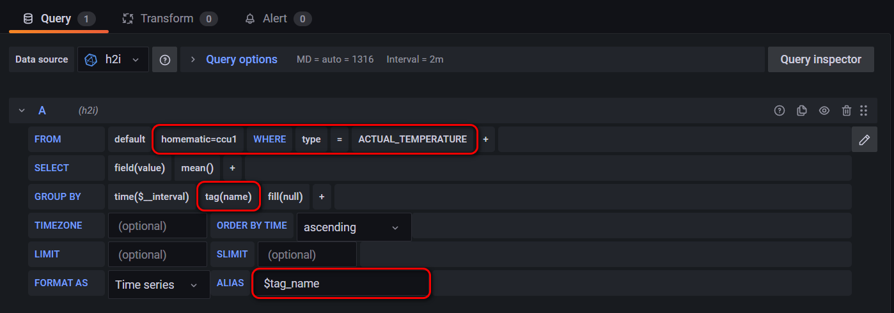

# h2i
Pull data from homematic ccu via xmlapi and stores them inside a time series database like influxdb.

## Install
Easy and strait forward. Just 3 steps are needed:
1. Download and unpack the zip file or clone the git repository.
2. Edit the settings section of h2i file with you desired program editor.
3. Move the h2i file to /usr/local/bin.

Now h2i is ready to use.

You can use the folowing short script to call h2i every minute from cron. Just place the follwing script at /etc/cron.d/h2i. Don't forget to replace [user] with the user name you want to run the script with.

<pre>
SHELL=/bin/bash
PATH=/usr/local/sbin:/usr/local/bin:/sbin:/bin:/usr/sbin:/usr/bin
* * * * * [user] /usr/local/bin/h2i pull >/dev/null 2>&1
</pre>

## Use
<pre>
Usage:  
  h2i [command] [option]  

Available Commands:  
  version, -v, --version     - Print version information  
  help, -h, --help           - Print this help message  
  pull, -p, --pull           - Gets values from given device ids  

Available Options:  
  debug, -d, --debug         - Enables Debug informations  
</pre>

## Device list
Getting the device list of your devices can be done by the following comand line. In further versions of h2i I will build in the `list` command for this.

`curl -s http://homematic/addons/xmlapi/statelist.cgi | xmllint --xpath //device > devices.xml -`

In the `settings` chapter of h2i you need to set the list_of_ids in the following format:
<pre>
FORMAT: ise_id,type1,type2,type3,...

EXAMPLE: 
6456,SET_TEMPERATURE,ACTUAL_TEMPERATURE,VALVE_STATE,BATTERY_STATE
2469,SET_TEMPERATURE,ACTUAL_TEMPERATURE,VALVE_STATE,BATTERY_STATE,LOWBAT
3564,ENERGY_COUNTER,POWER,CURRENT,VOLTAGE,FREQUENCY,STATE
7846,ACTUAL_TEMPERATURE,HUMIDITY,ILLUMINATION,RAIN_COUNTER,SUNSHINEDURATION,WIND_DIR,WIND_DIR_RANGE,WIND_SPEED,LOW_BAT
6185,STATE,LOWBAT
</pre>

## Visualisation
In grafana you can use the group by option to get all values of one type into on graph with just one db query.  

`SELECT mean("value") FROM "homematic=ccu1" WHERE ("type" = 'ACTUAL_TEMPERATURE') AND $timeFilter GROUP BY time($__interval), "name" fill(null)`

## ToDo
* Add `list` command for getting and showing available device ids and types.
* Use GNU parallel to speed up the parsing process if avaiable.
* Outsource settings and list of id's into a separate file.
* Add `install` and `update` command.
* Add option for `silent-run` and `dry-run`.

## Changelog
1.2.2
* Add settings section.
* Update README with install an use info.

1.2.1
* Check if connection to ccu can be made and give error message if not.
* Clean up staelist on program finish.
* Silend run of curl und xmllint.

1.2.0
* Check enviroment for needed programs and give sugesstions on how to install them.

1.1.0
* Better code documentation.

1.0.0
* Initial Version with basic feature set.

## Authors
Torsten Scholz (exolon)

## Licence
GNU LGPLv3

## Disclaimer
You use this project at your own risk. This is not a solution that should be used in productive environments, but this code and guide could give you a quick start for your own experiments. Please keep also in mind that there are currently some security features missing.
